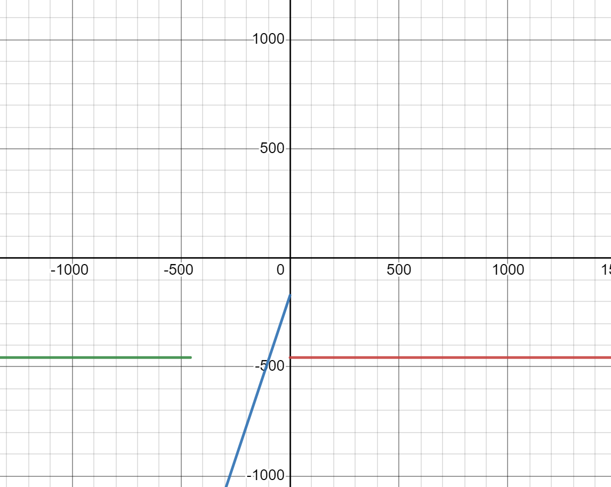

<!-- # Отчет по лабораторной работе №1 -->
#### «Национальный исследовательский университет ИТМО»
### Основы профессиональной деятельности
## Лабораторная работа 4
## Вариант 3101
### Хабнер Георгий, P3131
###  2023

## Задание
> По выданному преподавателем варианту восстановить текст заданного варианта программы, определить предназначение и составить описание программы, определить область представления и область допустимых значений исходных данных и результата, выполнить трассировку программы.

## Исходные данные

| Адрес | Код  | Мнемоника   | Комментарий                                                                   |
|-------|------|-------------|-------------------------------------------------------------------------------|
| 23D   | 0200 | CLA         | Очистка аккумулятора                                                          |
| 23E   | EE19 | ST (IP+25)  | Запись значения аккумулятора в A                                              |
| 23F   | AE15 | LD (IP+21)  | Запись значение B в аккумулятор                                               |
| 240   | 0740 | DEC         | Уменьшение значения в аккумуляторе на 1                                       |
| 241   | 0С00 | PUSH        | Записать значение аккумулятора в стек (-SP)                                   |
| 242   | D6D6 | CALL 0x6D6  | Вызов подпрограммы, начинающуюся в ячейке 0x6D6                               |
| 243   | 0800 | POP         | Запись значения из стека в аккумулятор                                        |
| 244   | 4E13 | ADD (IP+19) | Сложить A с аккумулятором и записать в аккумулятор                            |
| 245   | EE12 | ST (IP+18)  | Записать значение аккумулятора в A                                            |
| 246   | AE0F | LD (IP+15)  | Записать значение C в аккумулятор                                             |
| 247   | 0700 | INC         | Увеличение значения аккумулятора на 1                                         |
| 248   | 0С00 | PUSH        | Записать значение аккумулятора в стек (-SP)                                   |
| 249   | D6D6 | CALL 0x6D6  | Вызов подпрограммы, начинающуюся в ячейке 0x6D6                               |
| 24A   | 0800 | POP         | Запись значения из стека в аккумулятор                                        |
| 24B   | 6E0C | SUB (IP+12) | Отнять из значения аккумулятора A и записать в аккумулятор                    |
| 24С   | EE0B | ST (IP+11)  | Записать значение аккумулятора в A                                            |
| 24D   | AE09 | LD (IP+9)   | Записать значение D в аккумулятор                                             |
| 24E   | 0C00 | PUSH        | Записать значение аккумулятора в стек (-SP)                                   |
| 24F   | D6D6 | CALL 0x6D6  | Вызов подпрограммы, начинающуюся в ячейке 0x6D6                               |
| 250   | 0800 | POP         | Запись значения из стека в аккумулятор                                        |
| 251   | 0700 | INC         | Увеличение значения аккумулятора на 1                                         |
| 252   | 6E05 | SUB (IP+5)  | Отнять из значения аккумулятора A и записать в аккумулятор                    |
| 253   | EE04 | ST (IP+4)   | Записать значение аккумулятора в A                                            |
| 254   | 0100 | HLT         | Остановка программы                                                           |
| 255   | ZZZZ | B           | Входная переменная                                                            |
| 256   | YYYY | C           | Входная переменная                                                            |
| 257   | XXXX | D           | Входная переменная                                                            |
| 258   | 0071 | A           | Выходная переменная                                                           |

| Адрес | Код  | Мнемоника   | Комментарий                                                                   |
|-------|------|-------------|-------------------------------------------------------------------------------|
| 6D6   | AC01 | LD (SP+1)   | Загрузка второго элемента стека в аккумулятор                                 |
| 6D7   | F001 | BEQ         | если значение в аккумулятое = 0, перейти в ячейку 0x6D9                       |
| 6D8   | F308 | BPL         | если флаг значение в аккумулятое положительное, перейти в ячейку 6E1          |
| 6D9   | 7E0A | CMP         | выставить флаги по разности значения ячейки E и аккумулятора                  |
| 6DA   | F806 | BLT         | если значение в аккумулятое < E, перейти в ячейку 6E1                         |
| 6DB   | F005 | BEQ         | если значение в аккумулятое = 0, перейти в ячейку 6E1                         |
| 6DC   | 0500 | ASL         | Умножить AC на 2                                                              |
| 6DD   | 0500 | ASL         | Умножить AC на 2                                                              |
| 6DE   | 6C01 | SUB (SP+1)  | Отнять из значения аккумулятора второй элемент стека и записать в аккумулятор |
| 6DF   | 6E05 | SUB (IP+5)  | Отнять из значения аккумулятора F и записать в аккумулятор                    |
| 6E0   | CE01 | JUMP (IP+1) | Переход в ячейку 0x6E2                                                        |
| 6E1   | AE02 | LD (IP+2)   | Записать значение E в аккумулятор                                             |
| 6E2   | EC01 | ST (SP+1)   | Запись во второй элемент стека значение аккумулятора                          |
| 6E3   | 0A00 | RET         | Возврат с места вызова                                                        |
| 6E4   | FE37 | E           | Значение                                                                      |
| 6E5   | 00AB | F           | Значение                                                                      |

##Функция вычисляемая программой
Подсчет функции от трех переменных по формуле:

A = func(D)+1-func(C+1)+func(B-1)

    def func(arg):
        e = -457
        f = 171
        ac = arg
    
        if ac <= 0: 
            if ac > e:
                ac *= 3
                ac -= f
            else:
                ac = e
        else:
            ac = e
        return ac

func -> (3arg-171) -457<arg<=0
func -> (-457) arg<=-457, arg>0

##ОП и ОДЗ программы

E, F (0x694-0x695)- константы функии, знаковые числа
E = FE37 = -457
F = 00AB = 171
 - При значении аргумента функции в промежутке [-2^15; -457] и [1; 2^15 - 1], функция вернет значение -457. При использовании любого значения из заданного промежутка в функции не возникнет переполнения.
 - При оставшихся значениях аргумента функция вернет выражение 3x - 171. На промежутке [-456; 0] эта функция монотонно возрастающая, поэтому рассмотрим минимальное и максимальное значение: 
>f_min=f(-456)=-1539
f_max=f(0)=-171

что означает, что на всем промежутке значений аргумента, результат функции будет находиться на отрезке [-1539; -171]. 

Так как основная программа вычисляет следующее выражение: 
A = f(D)+1-f(C+1)+f(B-1)
То максимально мы можем получить: -171+1-(-1539)+(-171) = 1198 < 2^15-1
А минимально: -1539+1-(-171)+(-1539) = -2906 > -2^15

> D (0x257) - входное знаковое число (от -2^15 до 2^15-1)
> С (0x256) - входное знаковое число (от -2^15 до 2^15-2)
> B (0x255) - входное знаковое число (от -2^15+1 до 2^15-1) 
> A (0x258) - выходные данные, знакоквое число (от -2906 до 1198)

##Трассировка

Входные данные:
- D = FDA8
- C = 001C
- B = FFF8

| Адр | Знчн | IP  | CR   | AR  | DR   | SP  | BR   | AC   | PS  | NZVC | Адр | Знчн |
|-----|------|-----|------|-----|------|-----|------|------|-----|------|-----|------|
| 23D | 0200 | 23E | 0200 | 23D | 0200 | 000 | 023D | 0000 | 004 | 0100 |     |      |
| 23E | EE19 | 23F | EE19 | 258 | 0000 | 000 | 0019 | 0000 | 004 | 0100 | 258 | 0000 |
| 23F | AE15 | 240 | AE15 | 255 | FFF8 | 000 | 0015 | FFF8 | 008 | 1000 |     |      |
| 240 | 0740 | 241 | 0740 | 240 | 0740 | 000 | 0240 | FFF7 | 009 | 1001 |     |      |
| 241 | 0C00 | 242 | 0C00 | 7FF | FFF7 | 7FF | 0241 | FFF7 | 009 | 1001 | 7FF | FFF7 |
| 242 | D6D6 | 6D6 | D6D6 | 7FE | 0243 | 7FE | D6D6 | FFF7 | 009 | 1001 | 7FE | 0243 |
| 6D6 | AC01 | 6D7 | AC01 | 7FF | FFF7 | 7FE | 0001 | FFF7 | 009 | 1001 |     |      |
| 6D7 | F001 | 6D8 | F001 | 6D7 | F001 | 7FE | 06D7 | FFF7 | 009 | 1001 |     |      |
| 6D8 | F308 | 6D9 | F308 | 6D8 | F308 | 7FE | 06D8 | FFF7 | 009 | 1001 |     |      |
| 6D9 | 7E0A | 6DA | 7E0A | 6E4 | FE37 | 7FE | 000A | FFF7 | 001 | 0001 |     |      |
| 6DA | F806 | 6DB | F806 | 6DA | F806 | 7FE | 06DA | FFF7 | 001 | 0001 |     |      |
| 6DB | F005 | 6DC | F005 | 6DB | F005 | 7FE | 06DB | FFF7 | 001 | 0001 |     |      |
| 6DC | 0500 | 6DD | 0500 | 6DC | FFF7 | 7FE | 06DC | FFEE | 009 | 1001 |     |      |
| 6DD | 0500 | 6DE | 0500 | 6DD | FFEE | 7FE | 06DD | FFDC | 009 | 1001 |     |      |
| 6DE | 6C01 | 6DF | 6C01 | 7FF | FFF7 | 7FE | 0001 | FFE5 | 008 | 1000 |     |      |
| 6DF | 6E05 | 6E0 | 6E05 | 6E5 | 00AB | 7FE | 0005 | FF3A | 009 | 1001 |     |      |
| 6E0 | CE01 | 6E2 | CE01 | 6E0 | 06E2 | 7FE | 0001 | FF3A | 009 | 1001 |     |      |
| 6E2 | EC01 | 6E3 | EC01 | 7FF | FF3A | 7FE | 0001 | FF3A | 009 | 1001 | 7FF | FF3A |
| 6E3 | 0A00 | 243 | 0A00 | 7FE | 0243 | 7FF | 06E3 | FF3A | 009 | 1001 |     |      |
| 243 | 0800 | 244 | 0800 | 7FF | FF3A | 000 | 0243 | FF3A | 009 | 1001 |     |      |
| 244 | 4E13 | 245 | 4E13 | 258 | 0000 | 000 | 0013 | FF3A | 008 | 1000 |     |      |
| 245 | EE12 | 246 | EE12 | 258 | FF3A | 000 | 0012 | FF3A | 008 | 1000 | 258 | FF3A |
| 246 | AE0F | 247 | AE0F | 256 | 001C | 000 | 000F | 001C | 000 | 0000 |     |      |
| 247 | 0700 | 248 | 0700 | 247 | 0700 | 000 | 0247 | 001D | 000 | 0000 |     |      |
| 248 | 0C00 | 249 | 0C00 | 7FF | 001D | 7FF | 0248 | 001D | 000 | 0000 | 7FF | 001D |
| 249 | D6D6 | 6D6 | D6D6 | 7FE | 024A | 7FE | D6D6 | 001D | 000 | 0000 | 7FE | 024A |
| 6D6 | AC01 | 6D7 | AC01 | 7FF | 001D | 7FE | 0001 | 001D | 000 | 0000 |     |      |
| 6D7 | F001 | 6D8 | F001 | 6D7 | F001 | 7FE | 06D7 | 001D | 000 | 0000 |     |      |
| 6D8 | F308 | 6E1 | F308 | 6D8 | F308 | 7FE | 0008 | 001D | 000 | 0000 |     |      |
| 6E1 | AE02 | 6E2 | AE02 | 6E4 | FE37 | 7FE | 0002 | FE37 | 008 | 1000 |     |      |
| 6E2 | EC01 | 6E3 | EC01 | 7FF | FE37 | 7FE | 0001 | FE37 | 008 | 1000 | 7FF | FE37 |
| 6E3 | 0A00 | 24A | 0A00 | 7FE | 024A | 7FF | 06E3 | FE37 | 008 | 1000 |     |      |
| 24A | 0800 | 24B | 0800 | 7FF | FE37 | 000 | 024A | FE37 | 008 | 1000 |     |      |
| 24B | 6E0C | 24C | 6E0C | 258 | FF3A | 000 | 000C | FEFD | 008 | 1000 |     |      |
| 24C | EE0B | 24D | EE0B | 258 | FEFD | 000 | 000B | FEFD | 008 | 1000 | 258 | FEFD |
| 24D | AE09 | 24E | AE09 | 257 | FDA8 | 000 | 0009 | FDA8 | 008 | 1000 |     |      |
| 24E | 0C00 | 24F | 0C00 | 7FF | FDA8 | 7FF | 024E | FDA8 | 008 | 1000 | 7FF | FDA8 |
| 24F | D6D6 | 6D6 | D6D6 | 7FE | 0250 | 7FE | D6D6 | FDA8 | 008 | 1000 | 7FE | 0250 |
| 6D6 | AC01 | 6D7 | AC01 | 7FF | FDA8 | 7FE | 0001 | FDA8 | 008 | 1000 |     |      |
| 6D7 | F001 | 6D8 | F001 | 6D7 | F001 | 7FE | 06D7 | FDA8 | 008 | 1000 |     |      |
| 6D8 | F308 | 6D9 | F308 | 6D8 | F308 | 7FE | 06D8 | FDA8 | 008 | 1000 |     |      |
| 6D9 | 7E0A | 6DA | 7E0A | 6E4 | FE37 | 7FE | 000A | FDA8 | 008 | 1000 |     |      |
| 6DA | F806 | 6E1 | F806 | 6DA | F806 | 7FE | 0006 | FDA8 | 008 | 1000 |     |      |
| 6E1 | AE02 | 6E2 | AE02 | 6E4 | FE37 | 7FE | 0002 | FE37 | 008 | 1000 |     |      |
| 6E2 | EC01 | 6E3 | EC01 | 7FF | FE37 | 7FE | 0001 | FE37 | 008 | 1000 | 7FF | FE37 |
| 6E3 | 0A00 | 250 | 0A00 | 7FE | 0250 | 7FF | 06E3 | FE37 | 008 | 1000 |     |      |
| 250 | 0800 | 251 | 0800 | 7FF | FE37 | 000 | 0250 | FE37 | 008 | 1000 |     |      |
| 251 | 0700 | 252 | 0700 | 251 | 0700 | 000 | 0251 | FE38 | 008 | 1000 |     |      |
| 252 | 6E05 | 253 | 6E05 | 258 | FEFD | 000 | 0005 | FF3B | 008 | 1000 |     |      |
| 253 | EE04 | 254 | EE04 | 258 | FF3B | 000 | 0004 | FF3B | 008 | 1000 | 258 | FF3B |
| 254 | 0100 | 255 | 0100 | 254 | 0100 | 000 | 0254 | FF3B | 008 | 1000 |     |      |
